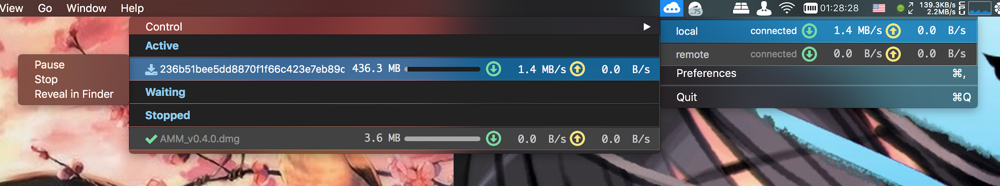

# AMM 
Aria2 Menubar Monitor, a tool to help with monitoring Aria2 Status on the macOS menubar.

[中文说明](./README_zh.md)

# Features
- Fetch status of Aria2 server using Aria2 RPC (via websocket) and display it.
- Multiple Aria2 servers support. Refresh interval of global status and tasks can be configured for each server.
- Drag and Drop to reorder Aria2 servers.
- ws/wss(self-signed certificate included) support
- Dark Mode
- Control Mode for task management
- Associate with Magnet Link

# Screenshots
## Light Mode


## Dark Mode


# Prerequisites
OS X 10.10+ or macOS 10.12.x

# Download
See [Releases](https://github.com/15cm/AMM/releases)

# Test and Build Environment
- macOS Sierra 10.13.2
- Xcode 9.2
- Swift 4.0.3
- carthage 0.27.0

# How to build
``` sh
git clone https://github.com/15cm/AMM.git
cd AMM
carthage update --platform mac --no-use-binaries
open AMM.xcodeproj
```

Then press Cmd-b in **Xcode** to build **AMM**

# Thanks
- [aria2](https://github.com/aria2/aria2) 
- [SwiftyJSON](https://github.com/SwiftyJSON/SwiftyJSON)
- [Starscream](https://github.com/daltoniam/Starscream)
- [SwiftyUserDefaults](https://github.com/radex/SwiftyUserDefaults)
- [Maria](https://github.com/ShinCurry/Maria) (Implementation partial reference)

# License
GPL 3.0
