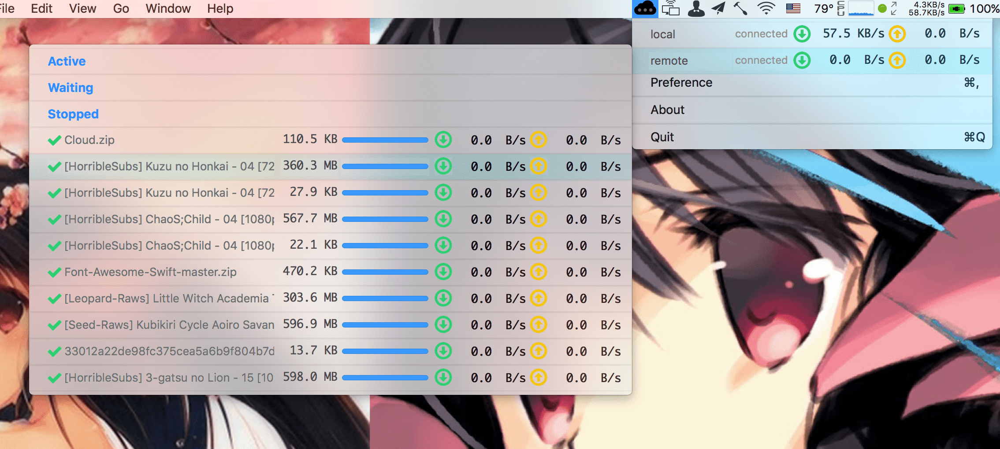

# AMM
Aria2 Menubar Monitor,  在 macOS 菜单栏上监控 Aria2 的工具。

# 功能
- 通过 Aria2 RPC 接口获取 Aria2 状态，显示在 menubar 中（走 websocket）
- 多服务器支持，可配置各个服务器状态和任务的刷新时间间隔

# 截图

# 下载
见 [Release](https://github.com/15cm/AMM/releases)

# 运行环境
OS X 10.10+ or macOS 10.12.x

# 测试、构建环境
- macOS Sierra 10.12.3 (16D32)
- Xcode 8.2.1 (8C1002)
- Swift 3.0.2
- carthage 0.18.1

# 感谢
- [aria2](https://github.com/aria2/aria2) 
- [SwiftyJSON](https://github.com/SwiftyJSON/SwiftyJSON)
- [Starscream](https://github.com/daltoniam/Starscream)
- [Maria](https://github.com/ShinCurry/Maria) （部分实现思路参考）

# 许可证书
GPL 3.0
