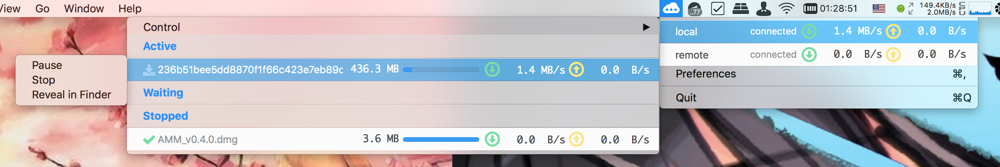
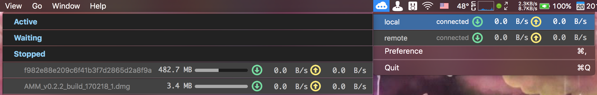

# AMM
Aria2 Menubar Monitor,  在 macOS 菜单栏上监控 Aria2 的工具。

# 功能
- 通过 Aria2 RPC 接口获取 Aria2 状态，显示在 menubar 中（走 websocket）
- 多服务器支持，可配置各个服务器状态和任务的刷新时间间隔
- ws/wss(包括自签证书)支持
- 暗色主题

# 截图
## 亮色主题


## 暗色主题


# 运行环境
OS X 10.10+ or macOS 10.12.x

# 备注
## 关于设置中的数值
在目前版本中，「AMM 偏好设置」中的所有数值不会被验证（验证功能会在以后版本添加）
所以需要用户自己确保设置数值的合理性，尤其是刷新时间，建议不要短于 0.5(s)。

## 关于设置的变更
有时（特别是刷新时间设置得过短时）每一次设置修改被确认（即用户点击按钮关闭设置窗口时）的行为可能导致内存泄漏。
因此当你数次变更设置后发现 **AMM** 占用资源过多，请重启 **AMM**。

# 下载
见 [Release](https://github.com/15cm/AMM/releases)

# 测试、构建环境
- macOS Sierra 10.12.3 (16D32)
- Xcode 8.2.1 (8C1002)
- Swift 3.0.2
- carthage 0.18.1

# 构建流程
``` sh
git clone https://github.com/15cm/AMM.git
cd AMM
carthage update --platform mac --no-use-binaries
open AMM.xcodeproj
```

然后在 **Xcode** 中按 Cmd-b 构建 **AMM**

# 感谢
- [aria2](https://github.com/aria2/aria2) 
- [SwiftyJSON](https://github.com/SwiftyJSON/SwiftyJSON)
- [Starscream](https://github.com/daltoniam/Starscream)
- [SwiftyUserDefaults](https://github.com/radex/SwiftyUserDefaults)
- [Maria](https://github.com/ShinCurry/Maria) （部分实现思路参考）

# 许可证书
GPL 3.0
